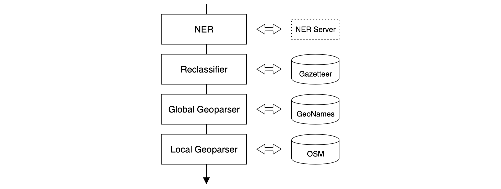

# txt2map

txt2map is a street-level geoparser written in Python. Unlike other geoparsers, txt2map does not only detect well-known names of countries and cities, but also names of street, points of interest and other facilities all around the world. You can try it out [here](http://54.229.3.214). 

## Approach

The txt2map geoparser recognizes place names (toponyms) in text documents and resolves them to [GeoNames](https://www.geonames.org) or [OpenStreetMap](https://www.openstreetmap.org) entities. The system consists of four separate modules that form a text processing pipeline.

- The Named Entity Recognition (NER) module recognizes globally significant toponyms
- The reclassification module attempts to catch mislabelled entities
- The global geoparser extracts references to cities and larger entities
- The local geoparser extracts references to locations within the mentioned cities

The output is a document with several layers of annotations. Global annotations link toponyms to GeoNames entries and local annotations link toponyms to OpenStreetMap references. To visualize the extracted references, the package includeds a web frontend.

## Usage

The geoparsing system is modular. The central component is the UI server, which hosts the web frontend and runs the processing pipeline. For NER txt2map relies on third-party software. Supported NER systems are:

- [spaCy](https://spacy.io) hosted on a dedicated server
- [Stanford NER](https://nlp.stanford.edu/software/CRF-NER.shtml) hosted on a dedicated server
- [Illinois NER](https://cogcomp.seas.upenn.edu/page/software_view/NETagger) (part of CogComp) hosted on a dedicated server
- the [Google Cloud Natural Language API](https://cloud.google.com/natural-language/)

Server implementations for the first three options are located in the [ner-server](ner-server) directory.

The UI server as well as the stand-alone NER servers come with Dockerfiles ([UI](Dockerfile), [spaCy](ner-server/spacy/Dockerfile), [Stanford](ner-server/cogcomp/Dockerfile), [CogComp](ner-server/stanford/Dockerfile)) for simple distribution. Automated builds are available from [DockerHub](https://hub.docker.com/repository/docker/ernestoelsaesser/txt2map/general).

The text processing pipeline itself is a Python 3 module and can be used directly from code. The repository includes additional modules for evaluation and web servers:

- `geoparser` - NER and geoparsing logic, document and pipeline models
- `evaluation` - code for corpus evaluation (used for the thesis)
- `ui-server` - UI server frontend and backend
- `ner-server` - HTTP wrappers for NER tools (partially in Java)

The `run-xxx.sh` scripts in the root directory can be used to build and run all included components and are a good starting point to explore the system. The `run-docker-xxx.sh` scripts require a running Docker deamon.

## OpenStreetMap Data

The geoparser dynamically loads substantial amounts of data from OSM. For every mentioned city (or town or hamlet), the system loads location names within a 15km radius from OSM (distance configurable). The data is cached in local SQLite databases to avoid redundant loads. The size of these databases ranges from a few KB to ~15MB per city, depending on its size and population density. This can cause longer response time when the system encounters a city name for the first time. The system uses the [Overpass API](https://wiki.openstreetmap.org/wiki/Overpass_API) to retrieve OSM data. The [Overpass QL](https://wiki.openstreetmap.org/wiki/Overpass_API/Overpass_QL) template can be found [here](geoparser/osm.py#L84). 

## Evaluation

The repository includes an evaluation package that provides a framework for corpus evaluation. The package contains the two corpora used for evaluation in the thesis, [GeoWebNews](https://link.springer.com/article/10.1007/s10579-019-09475-3) and the [Local-Global Lexicon](https://ieeexplore.ieee.org/abstract/document/5447903) (both obtained from Milan Gritta's [collection of geoparsing resources](https://github.com/milangritta/Pragmatic-Guide-to-Geoparsing-Evaluation)). The package further includes code to annotate these corpora using the different pipeline configurations and as well as other geoparsing solutions. Supported metrics are precision, recall, F1-score and Accuracy@Xkm (percentage of references resolved within an error distance of X kilometers).